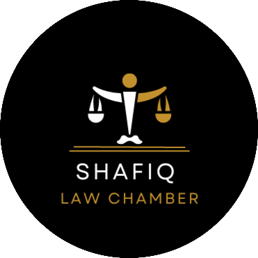

    
   

<h1 align="center">
    
     Welcome to Shafiq Law Chamber
</h1>

  

    
  

 

Welcome to Shafiq Law Chamber, a renowned law firm in Pakistan. With a commitment to excellence and a client-centered approach, we provide top-notch legal services tailored to your needs. Led by experienced professionals, we are dedicated to protecting your rights and delivering favorable outcomes. Trust Shafiq Law Chamber as your reliable legal partner in Pakistan.